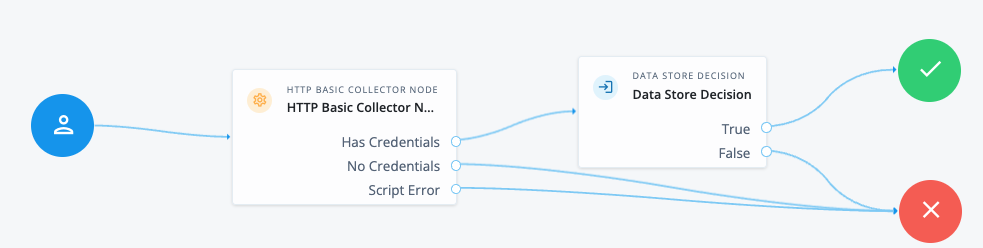

# HTTP-Basic-Collector-Node

This is an example Custom Node that can be imported into [Ping Advanced Identity Cloud](https://docs.pingidentity.com/pingoneaic/latest/journeys/node-designer.html#import-custom-node) or PingAM to be used in a journey.

The functionality is similar to the out-of-the-box [Zero Login Page Collector Node](https://docs.pingidentity.com/auth-node-ref/latest/zero-page-login-collector.html), however, it will decode a standard (legacy) Basic Authorization header as per [rfc7617](https://datatracker.ietf.org/doc/html/rfc7617), and push the username and password into the Journey's shared/transient states.

## Limitations

Note that as per the RFC, usernames should not contain : characters or this makes the parsing of the value impossible:

> The user-id and password MUST NOT contain any control characters (see
>  "CTL" in Appendix B.1 of [RFC5234]).
>
> Furthermore, a user-id containing a colon character is invalid, as
> the first colon in a user-pass string separates user-id and password
> from one another; text after the first colon is part of the password.
> User-ids containing colons cannot be encoded in user-pass strings.
>
> Note that many user agents produce user-pass strings without checking
> that user-ids supplied by users do not contain colons; recipients
> will then treat part of the username input as part of the password.

## Import file
The Custom Node import file can be downloaded [here](HTTP-Basic-Collector-Node.json)

## Code
The script source is [here](src/main.js)

## Example Journey
